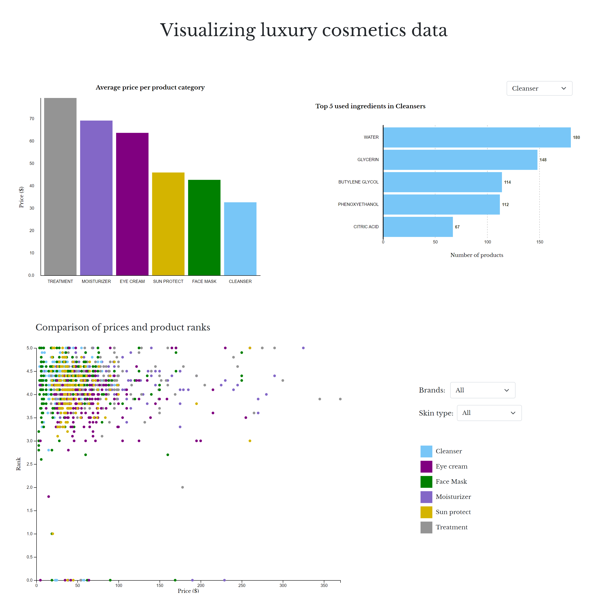

# Visualizing luxury cosmetics data
This is a project for the Data Visualization course. The design and style were crafted using Bootstrap and CSS and visualizations with D3.js.

Used [dataset](https://www.kaggle.com/datasets/kingabzpro/cosmetics-datasets/data) is from Kaggle.

## Visualization Page

    </img>  

